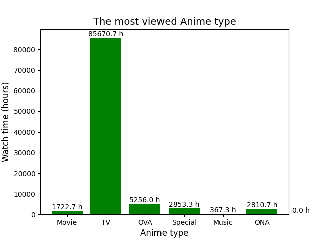

# Pandas_DS
### Dataset analysis with Pandas

Данные взяты с хаба **KaggleHub**:  
```shell
poetry add 'kagglehub[pandas-datasets]'
```
Подробнее:      
**Anime Recommendations Database**  
https://www.kaggle.com/datasets/CooperUnion/anime-recommendations-database


**Также данные могут быть загружены с Google Drive:**   
* **anime.csv**  
[Google Drive](https://drive.google.com/file/d/1we8TRCGbanA7jFWahADMV73N6SaM7rK9/view?usp=share_link "Перейти к файлу anime.csv")

* **rating.csv**  
[Google Drive](https://drive.google.com/file/d/1Y3J2ikBUldWRCYU5PSEdL3k1BupRXvtY/view?usp=share_link "Перейти к файлу rating.csv")

* **pandas_lecture.ipynb**  
[Google Drive](https://drive.google.com/file/d/1uezO9gZ23iRVY8HaOcXw-bz9Zfm5QsSC/view?usp=sharing "Перейти к файлу pandas_lecture.ipynb")

Для генерации графика наиболее просматриваемых типов аниме:
```shell
python anime_plot.py
```

Этот скрипт строит столбчатую диаграмму, показывающую суммарное время просмотров для каждого типа аниме
